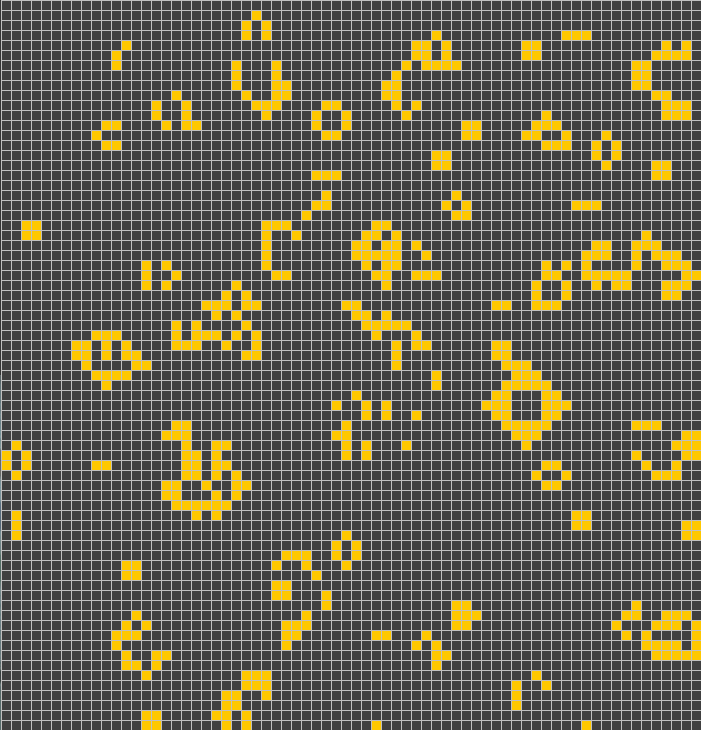

# Game Of Life

## Overview

This is a simple implementation of Conway's Game of Life in Java using regular AWT.

For an overview of what Game of Life is and how it works, read [here](https://en.wikipedia.org/wiki/Conway%27s_Game_of_Life).

## The Interface

The main window allows you to:

 - Load a preconfigured Seed
 - Start a Random Seed
 - Start / Stop the current simulation.
 - Pause / Play the current simulation.

The repository comes with 2 preconfigured seeds under `src/main/resources`:

 - `glider.txt`: A preconfigured Glider.
 - `seed.txt`: A preconfigured "Random" Seed.

## Examples

### Glider

### Random

## Running

### Prerequisites

 - Java >= 1.8
 - Maven
 
### Clone Repository

`git clone https://gitlab.com/astercrono/game-of-life.git && cd game-of-life`

### Building

`mvn package`

### Launching

`java -cp target/cronos-gameoflife-1.0-SNAPSHOT.jar net.astercrono.gameoflife.App`
